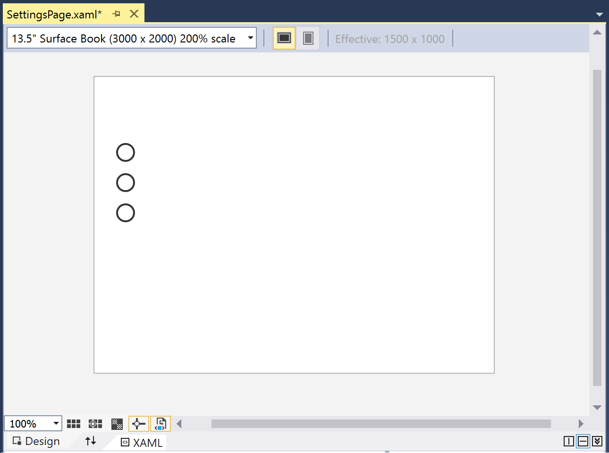
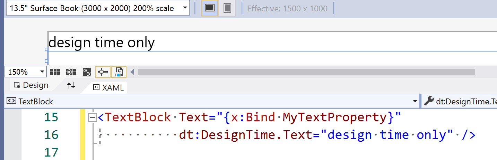
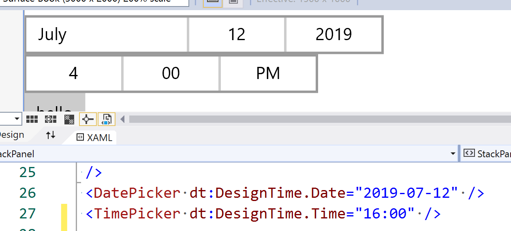

# UWP Design-Time Data

Allow UWP projects to use inline design-time data.

If using localization or bindings in your XAML you can end up with a page that looks empty in the designer.



This makes it hard to know what the UI will look like without running the app.


Xamarin.Forms already has this capability. Consider this a poly-fill until this functionality is provided by Visual Studio for all XAML dialects. Hopefully this will be soon. :crossed_fingers:

Do this:

1. `Install-Package UwpDesignTimeData`
2. Then, do things like this in your XAML: `dt:DesignTime:Text="Only shown in designer."`

You should see something like this:




The hope is that when official support is added, you'll be able to update your code to use it by removing the reference and replacing `dt:DesignTime.` with `d:`.

## Support for the following properties

You can use this library with any of the following `DesignTime` properties.

- Caption
- Content
- Date
- Description
- FlowDirection
- Footer
- Header
- Icon
- IsChecked
- IsOn
- Maximum
- MaxRating
- Minimum
- OffContent
- OnContent
- PaneFooter
- PaneHeader
- PaneTitle
- Password
- PasswordChar
- PlaceholderText
- PlaceholderValue
- QueryText
- Source
- Symbol
- Text
- Time
- Title
- Value

If the underlying element has the property the design-time content will be used in the designer. If it doens't have that property, the design-time value will be ignored.

## Improving the design-time experience

There are some things you can't visualize in the designer. But these can be seen with this library.

This includes specifying `Date` for the `DatePicker` and `Time` for the `TimePicker`.



## Other design-time data solutions

It's possible to specify a design-time **DataContext** to use and populate the designer. No guarantees are made for using such a solution in combination with this library. Your experience may vary depending on exactly what you're doing.

## Avoid impact at run-time

Ignore the XML namespace alias ('dt' in the example below) to avoid the design-time data being parsed at runtime.

```diff
    xmlns:dt="using:UwpDesignTimeData"

-   mc:Ignorable="d"
+   mc:Ignorable="d dt"
```

Even if you don't do this, the way the code is implemented means that it won't try and overwrite values, at run-time, the way it does in the designer.

The performance impact of including this library is tiny and should not be noticable. Please feel free to raise an issue if you have a way of reproducing a measurable impact at run-time.

## Important to know

Before you start using this, you should probably know the following:

- You may need to rebuild the app to force the designer to update and show the [changes to] design-time data.
- If you specify a property and the design-time version, specify the design-time version second.
- If you have any questions or suggestions for a new property to support at design-time, please raise an issue.
